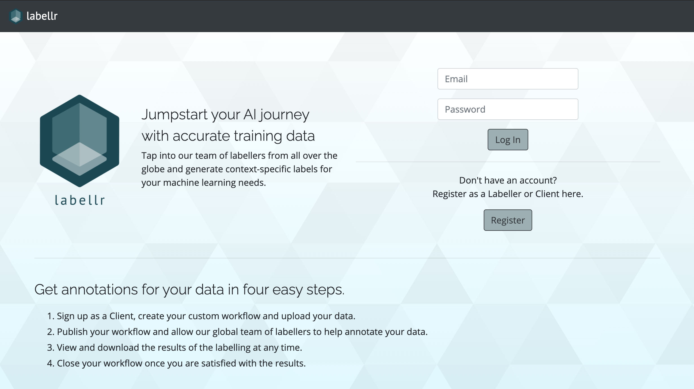

# Labellr
Project 2

## Crowdsourced Data Labelling

Hosted on [Heroku](http://labellr.herokuapp.com/)

### Motivation:
One of the many bottlenecks faced by data scientists is obtaining sufficient and accurate labelled training data as input into their models. 

Even though there is pre-labelled data readily available online, these labels may not be suited for the specific context in which the data scientists are trying to model. (e.g. “this vacuum cleaner sucks” - would this be a positive or negative sentiment?)

This app aims to provide a platform for crowdsourcing labellers to not only help label training data, but allow for users/data scientists to select different demographics to help label the data in specific contexts.

In the basic case, text content can come from restaurant reviews or forums. 

Clients here refer to data scientists who needs some training data labelled.

### References: 
- [Amazon SageMaker Ground Truth](https://aws.amazon.com/sagemaker/groundtruth/)
- [Google Captcha](https://aibusiness.com/document.asp?doc_id=760448&site=aibusiness)
- [Data Labeling Guide](https://www.cloudfactory.com/data-labeling-guide)
- [AI Platform Data Labeling Service](https://cloud.google.com/ai-platform/data-labeling/docs)

### Technologies:
- Node, Express, EJS
- Passport
- Mongo DB

### Models:
| User        | Text           | Image  |
| -------------|-------------|-----|
| Admin Labeller Client | textContent, length labelled language labelled sentiment labelled topic | imageUrl type of label result of label |

#### Job States
1. Not Started 
    - Job is initialized with this state
    - At this state, the Job is not visible to labellers
    - Client can make edits and also upload text to the job
2. In Progress
    - Job goes into this state when client clicks publish
    - Client no longer can upload text, but can still make edits to the job name/configs
    - Job is now visible to laballers and labellers can start labelling
    - Client can download labelling results at any time in this state
3. Closed
    - Job goes into this state when client clicks "Close Workflow"
    - Labeller can no longer label, but will see the job as closed
    - Job cannot be re-opened
    - Client can download labelling results at any time

### Labeller-Job states
This state represents the progress of the Labeller for the specified job
1. In Progress
    - Labeller has started labelling
2. Complete
    - Labeller has completed labelling all data points 
    - Labeller can no longer view the data

[User Stories](https://github.com/siu-sing/labellr/blob/master/plan/plan.md)

[Wire Frames](https://github.com/siu-sing/labellr/tree/master/plan)

### MVP at Start of project:
- CRUD for Text Model
- Login for Admin, Labeller and Client
- Routes for Labeller and Client
- Allow Admin to view all routes 
- Allow a labeller to label a piece of text with 
    - sentiment (1 for negative, 5 for positive, 3 for neutral

### Features at the end of project
- Clients
    - Set up and publish workflows for both Sentiment and Topic labelling
    - Build draft workflows and publish only when they are ready
    - Upload a text based csv file of data for labelling.
    - For Topic labelling, Clients can furnish a set of topics for Labellers to tag.
    - View summary stats on the workflow details page, and download a CSV of both topic and sentiment labelling results.
    - For Sentiment labelling, summary stats include a a count of the number of useful labels for each piece of data. Clients can decide to close the workflow if they have sufficient labels.
- Labellers 
    - Can take on multiple workflows at the same time. Progress of each labelling workflow will be saved in real time.

### Furthers:
- As a client, I would like to upload/link images for labellers to tag. And set up specific configurations for the tagging. Eg. (Is this a cat or dog?)
- As a client, I want to be able to select the demographic of my labellers (i.e. labellers aged 20-25, residing in singapore), so that my labels would be more contextual and accurate
- As a labeller, I want to be compensated in some way for my efforts, preferably compensation.
- As a client I would want to be able to connect to my data source (perhaps a DB of some kind), to regularly/automatically upload data for labelling.
- As a labeller, I would like to be able to access the labelling page in a more user friendly manner, perhaps a via chat bot.
- As a client, I would want to see more statistics about my workflow, maybe a visualization of the results.
- [rest of the backlog](https://github.com/siu-sing/labellr/blob/master/plan/plan.md)

### Credits and Acknowledgements
- Friends and classmates who gave feedback after testing my app.
- Ebere and TAs, for their guidance along the way.
- [Logo maker](https://hatchful.shopify.com/) - free and fast logo generator
- [SVG Background](https://www.svgbackgrounds.com/https://www.techighness.com/post/node-expressjs-endpoint-to-upload-and-process-csv-file/) - pure CSS backgrounds, code only